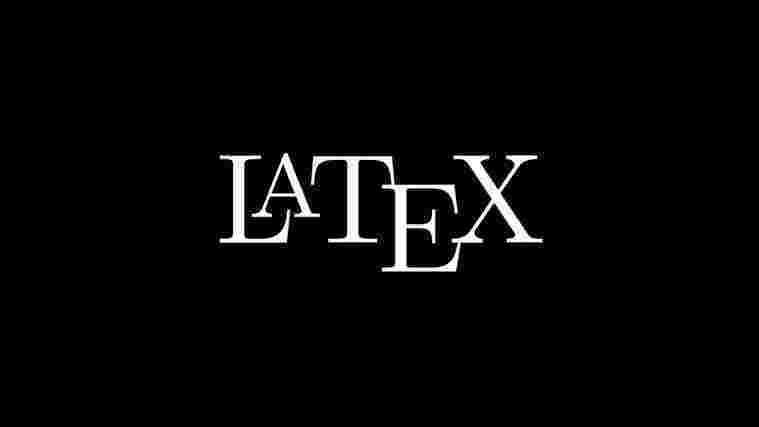

# LaTeXecute

<p align="center">

</p>

This is a simple demo of how the malware bash can be injected into LaTeX code. As you may know, there is some command allowing to execute arbitrary bash from .tex file.

Here is used a [shellexec](https://ctan.org/pkg/shellesc) package, which is included in latex-tools bundle. 

Payload is base64 encoded and hidden inside the .tex file. It just echo "pwned" to `~/pwn.txt`

## Test

You can test it by installing make and any package that include latex tools. For mac run:
```bash
brew install basictex
```

Or for linux using apt:
```bash
sudo apt-get install texlive-full 
```

Then just run `make all` and look at ~/pwn.txt

---

prod by _I3r1h0n_.
